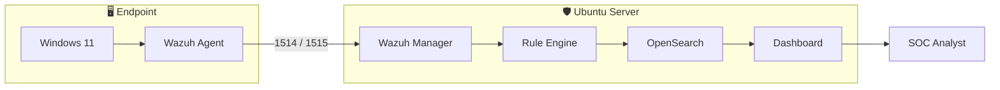
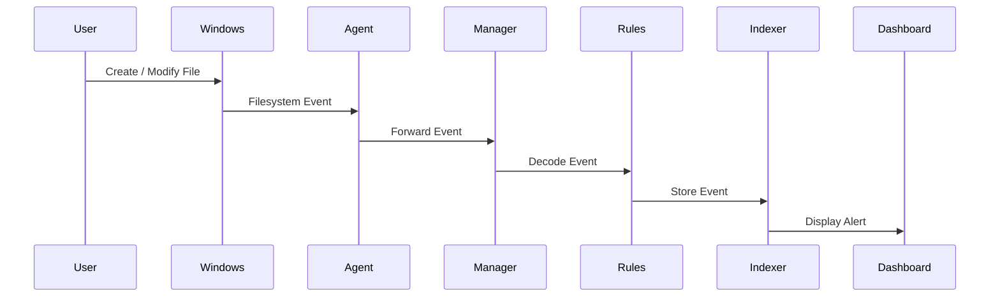
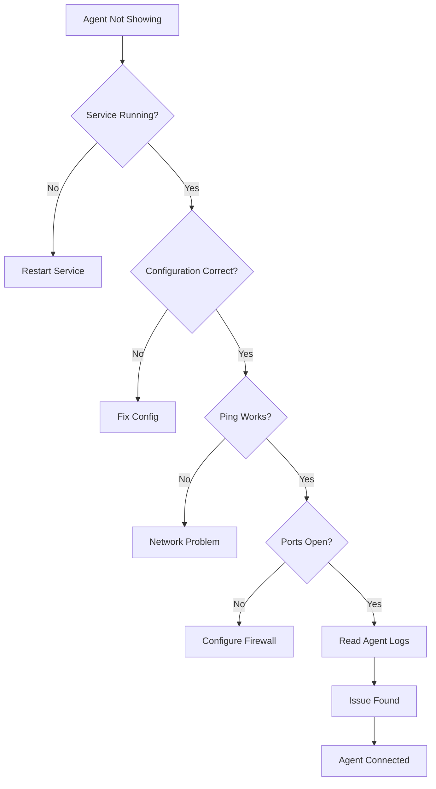
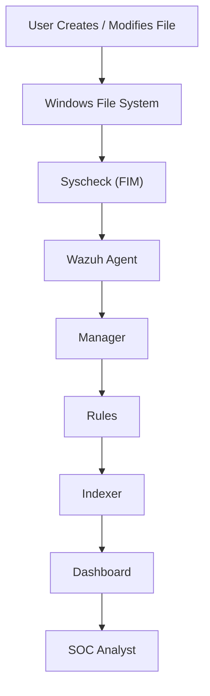
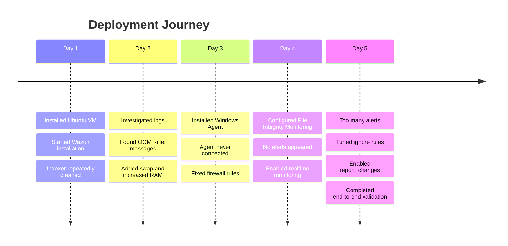
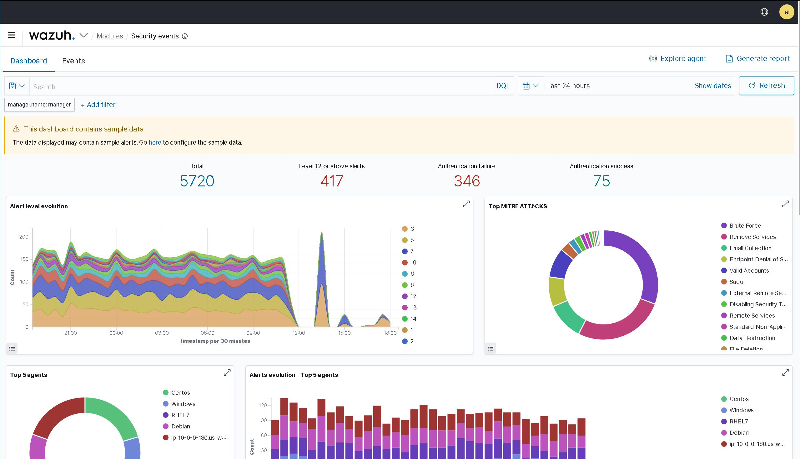
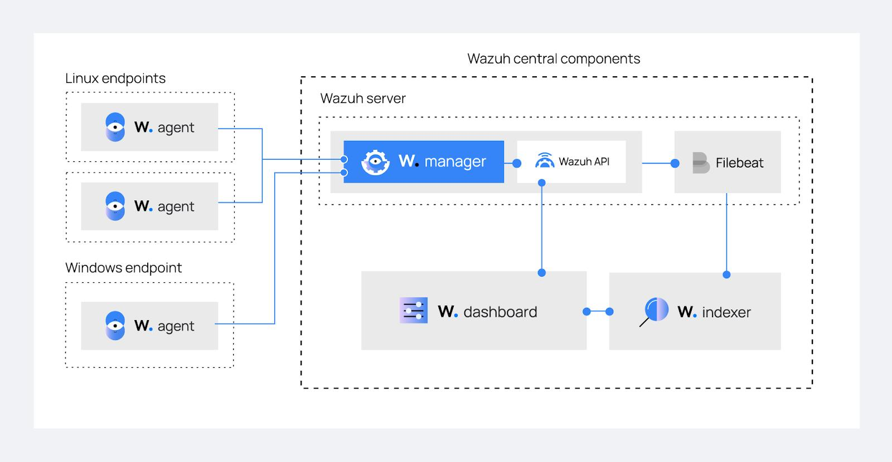
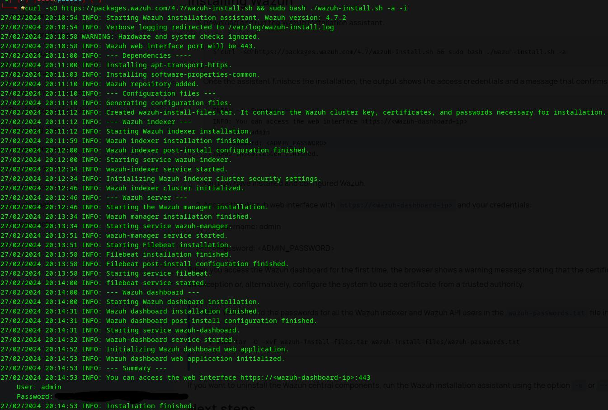
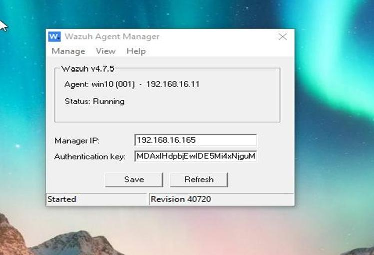
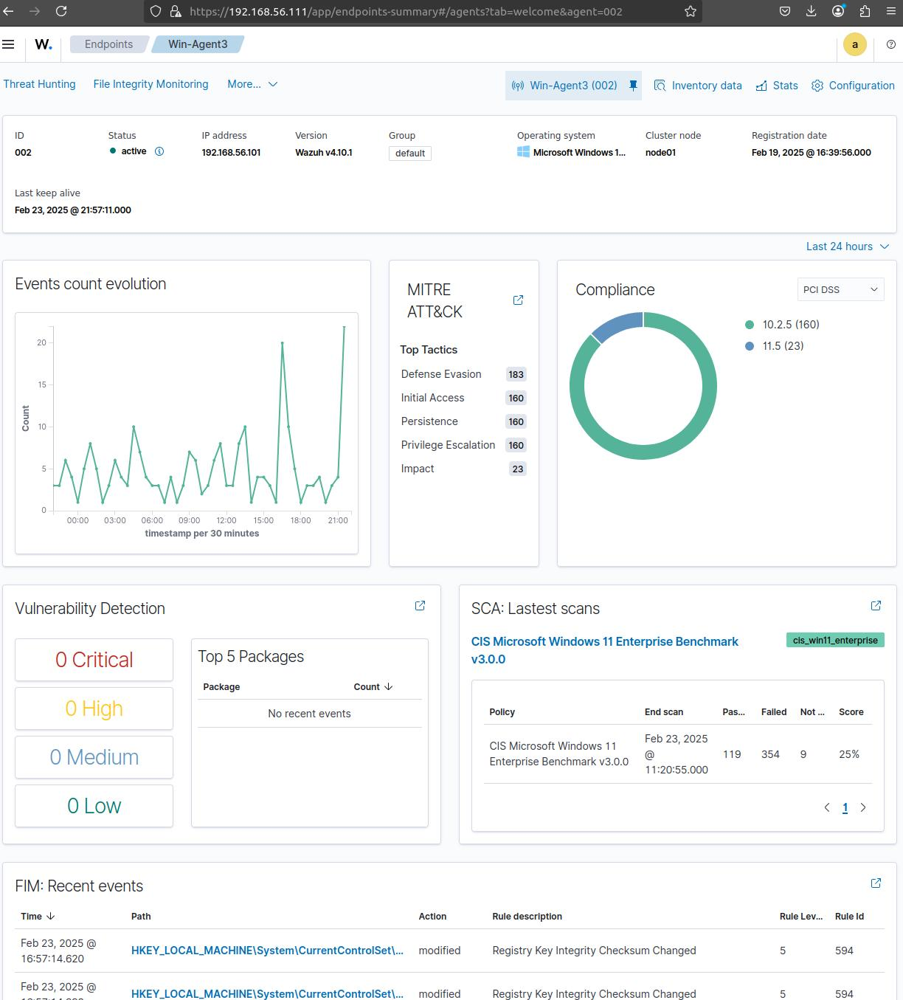

# 🛡️ Building a Cross-Platform SIEM with Wazuh


## 💭 Why I Built This

While exploring Security Operations Center (SOC) workflows, I kept encountering one term everywhere—**SIEM (Security Information and Event Management)**. Whether it was job descriptions, SOC analyst roadmaps, or blue team labs, SIEM platforms seemed to be the backbone of almost every security team.

Initially, I understood the concept only from diagrams and videos. A SIEM collects logs from different systems, correlates them, applies detection rules, and presents everything in a central dashboard. On paper, the workflow looked straightforward.

But one question kept bothering me:

> **How difficult is it to actually deploy and maintain one?**

Installing software is easy. Building a system that works reliably across multiple operating systems is a completely different challenge.

That's when I decided to stop reading documentation and build my own SOC lab from scratch. Instead of monitoring just one Linux machine, I wanted something that resembled a small enterprise environment. 

The plan was simple:
- An Ubuntu server would host the complete Wazuh stack.
- A Windows endpoint would act as the monitored workstation.
- Every security event generated on Windows would travel through the Wazuh Agent to the Ubuntu Manager.
- The Manager would analyze the event, store it inside OpenSearch, and display it through the dashboard.

On paper, that sounded like a weekend project. In reality, almost every stage introduced a new problem. Some failures were caused by hardware limitations. Some were networking mistakes. Others came from assumptions I made while reading the documentation. 

Looking back, those debugging sessions taught me far more than the successful installation ever could. This repository documents not only the final working setup but also the reasoning, mistakes, investigations, and fixes that eventually made everything work.

---

## ⚙️ Technology Stack

| Component | Purpose |
|-----------|----------|
| **Ubuntu 22.04 LTS** | Hosted the Wazuh server |
| **Windows 11** | Endpoint monitored by Wazuh |
| **Wazuh Manager** | Central event processing |
| **Wazuh Dashboard** | Visualization and investigation |
| **OpenSearch Indexer**| Event storage and indexing |
| **Wazuh Agent** | Endpoint monitoring |
| **Syscheck** | File Integrity Monitoring (FIM) |
| **UFW** | Ubuntu firewall management |
| **Windows Defender** | Endpoint firewall configuration |

---

## 🏗️ System Architecture



The architecture intentionally separates the monitored endpoint from the SIEM server, similar to how production environments operate. Instead of storing logs locally on the Windows machine, every event is securely forwarded to the Ubuntu server where it is decoded, analyzed, indexed, and visualized.

This separation ensures that even if the endpoint is compromised, the collected security events remain centrally available for investigation.

---

## 🚀 Deployment Roadmap


Each phase depended on the previous one. Although the roadmap appears linear, the actual deployment wasn't. Multiple stages required revisiting earlier configurations before the complete environment became operational.

---

## 🔍 Understanding the Alert Pipeline

Before deploying anything, I wanted to understand what actually happens after a file changes on the monitored endpoint.

The simplified workflow looks like this:



One realization during the project was that the Wazuh Agent doesn't decide whether an activity is malicious. Its responsibility is to collect telemetry from the endpoint and forward it to the Manager.

The Wazuh Manager performs the heavy lifting by decoding incoming events, matching them against detection rules, assigning severity levels, and deciding which alerts should be generated.

Finally, OpenSearch indexes those alerts, allowing the Dashboard to provide search capabilities, visualizations, and historical investigations.

---

## 🚀 Phase 1 — Setting Up the SIEM Infrastructure

### The Goal

The first milestone was getting the Wazuh stack running on an Ubuntu virtual machine. The installation itself seemed fairly straightforward because Wazuh provides an installation assistant that automatically installs and configures the required components.

The stack consisted of:
- Wazuh Manager
- Wazuh Dashboard
- Wazuh Indexer (OpenSearch)

Before starting, I assumed this would probably be the easiest part of the project. Download the installer, wait for a few minutes, log into the dashboard, and move on to configuring Windows.

That assumption didn't last very long.

---

### Initial Environment

| Component | Value |
|------------|-------|
| Operating System | Ubuntu 22.04 LTS |
| Virtualization | VMware Workstation |
| RAM | 4 GB *(initially)* |
| CPU | 2 vCPUs |
| Storage | 50 GB |
| Wazuh Version | 4.x |

---

### Installation

Following the official documentation, I downloaded the installation assistant.

```bash
curl -sO https://packages.wazuh.com/4.x/wazuh-install.sh
```

Made it executable.

```bash
chmod +x wazuh-install.sh
```

Started the installation.

```bash
sudo ./wazuh-install.sh -a
```

For the first few minutes everything looked normal. Packages were downloading, certificates were generated, configuration files were created, and services started one by one. I genuinely thought the installation was almost complete.

Then it suddenly stopped.

---

### The First Sign Something Was Wrong

The installer never actually reported an obvious error. Instead, it simply sat there for an unusually long time. Opening another terminal and checking the services revealed something strange.

```bash
systemctl status wazuh-indexer
```

The service wasn't running. Instead, it kept entering a restart loop.

```text
Starting...
Failed...
Restarting...
Failed...
Restarting...
```

At this point I assumed one of three things had happened:
- The installation script had a bug.
- Ubuntu wasn't compatible.
- OpenSearch had been installed incorrectly.

Looking back, all three assumptions were wrong.

---

### My First Mistake

Instead of investigating immediately, I almost reran the installation. Fortunately, I stopped myself. Reinstalling software rarely fixes infrastructure problems. If something crashes consistently, there's usually a reason. That was the point where I switched from "installer mode" to "debugging mode."

---

### Investigating the Failure

The first place I checked was the system logs.

```bash
journalctl -xe
```

The logs weren't very helpful. Next I checked:

```bash
cat /var/log/syslog
```

Still nothing obvious. Finally I checked the kernel logs.

```bash
dmesg
```

That immediately showed messages similar to:

```text
Out of memory:
Killed process 4721 (java)
```

That single line explained everything. The operating system wasn't waiting for OpenSearch to crash. It was actively killing it.

---

### Understanding What Happened

One thing I hadn't fully appreciated before this project was how resource-intensive OpenSearch actually is. Since it runs on Java, it allocates a significant amount of memory during startup. 

Inside a small virtual machine, there simply wasn't enough RAM available. Linux responded by activating the **OOM Killer (Out Of Memory Killer)**. Whenever the kernel decides the system is running critically low on memory, it terminates one of the largest running processes to keep the operating system alive. Unfortunately for me, that process was OpenSearch.

So technically... The installation wasn't failing. The operating system was preventing it from succeeding.

---

### Fixing the Problem

I considered rebuilding the virtual machine with more RAM, but I wanted to solve the problem without starting over. Instead I made two changes.

#### 1. Increased VM Memory
I increased the allocated RAM from **4 GB to 8 GB**. That immediately gave Java more room during startup.

#### 2. Added Swap Memory
I also created a 4 GB swap file so Ubuntu had additional virtual memory during heavy indexing operations.

```bash
sudo fallocate -l 4G /swapfile
sudo chmod 600 /swapfile
sudo mkswap /swapfile
sudo swapon /swapfile
```

To verify everything:

```bash
free -h
```

Now Ubuntu showed both physical memory and swap space.

---

### Verification

Restarted the service.

```bash
sudo systemctl restart wazuh-indexer
```

Checked its status.

```bash
systemctl status wazuh-indexer
```

This time the output stayed:

```text
Active (running)
```

A few moments later the dashboard became accessible through the browser. After spending nearly an hour assuming the installer was broken, the actual fix ended up being a hardware configuration change that took less than five minutes.

---

### What This Taught Me

This was probably the biggest lesson from the entire deployment. I learned that installation failures aren't always software problems. Sometimes the application is working exactly as expected, but the operating system simply doesn't have enough resources to support it.

More importantly, I learned the value of reading logs before changing configurations. If I had immediately reinstalled everything, I would have ended up with the exact same problem.

---

### 📸 Installation Screenshots

#### Installation Process


#### Wazuh Indexer Status


#### Dashboard Login


---

## 🌐 Phase 2 — Connecting the Windows Endpoint

With the Wazuh server finally running, I thought the difficult part was over. The next objective was to connect a Windows 11 machine to the Ubuntu server so that endpoint events could be collected centrally.

Compared to deploying OpenSearch, this seemed much simpler. Install the Wazuh Agent. Enter the server IP. Start the service. Wait for the dashboard. Done.

That was the plan. Reality had other ideas.

---

### Installing the Windows Agent

The Wazuh website provides an MSI installer for Windows. The installation itself was uneventful. During setup I entered:
- Manager IP Address
- Agent Name
- Enrollment Port

Once installation completed, I started the Wazuh service. A few seconds later I opened the Dashboard expecting to see my Windows endpoint listed under **Active Agents**.

Instead I saw this:

```text
Disconnected
Never Connected
```

That message was surprisingly frustrating because it didn't explain *why* the connection failed. The agent wasn't marked as offline. It wasn't showing an authentication error. It simply looked like it had never existed.

---

### My First Assumption

Since I had just installed the Windows Agent, my first thought was:
> "I probably configured the agent incorrectly."

So I checked the configuration. Everything looked correct. IP address. Agent name. Ports. Nothing seemed unusual. To be safe, I even restarted the Windows service.

Still nothing.

---

### The Second Assumption

Maybe the Windows service wasn't running.

```cmd
services.msc
```

Everything was running normally. No errors. No crashes. Still no agent.

At this point I was beginning to suspect that I had somehow broken the installation.

---

### Looking at the Logs

Whenever something behaves strangely, logs usually tell a better story than the dashboard. So I opened:

```text
C:\Program Files (x86)\ossec-agent\ossec.log
```

The log repeatedly printed messages similar to:

```text
Unable to connect to manager.
Retrying...
Unable to connect to manager.
Retrying...
```

Now I finally had something useful. The installation wasn't failing. The agent wasn't crashing. It simply couldn't reach the manager. That narrowed the search considerably.

---

### Testing Connectivity

The first thing I tried was the simplest possible test.

```cmd
ping <Ubuntu-IP>
```

Success. Replies came back immediately.

At first that actually confused me. If the two machines could communicate, why couldn't the agent connect?

After a little more reading I realized something that seems obvious in hindsight: **Ping only verifies ICMP connectivity.**

The Wazuh Agent doesn't communicate using ICMP. It communicates using specific TCP and UDP ports. Just because two machines can ping each other doesn't mean the required application ports are open.

That realization completely changed my approach.

---

### Firewall Investigation

Instead of looking at the agent configuration again, I shifted my attention to the Ubuntu server. Checking UFW showed that the required ports hadn't been opened. That explained why the manager never received the incoming connection.

I added the required firewall rules:

```bash
sudo ufw allow 1514/tcp
sudo ufw allow 1514/udp
sudo ufw allow 1515/tcp
```

To make sure the endpoint wasn't blocking outgoing traffic either, I also reviewed the Windows Defender Firewall configuration. Although Windows generally allows outbound traffic by default, I created an explicit outbound rule for the Wazuh Agent to eliminate any uncertainty.

Sometimes spending two minutes removing possible variables saves an hour of guessing.

---

### Restarting Everything

Once both firewall configurations were complete, I restarted the Windows Agent.

```cmd
net stop Wazuh
net start Wazuh
```

Then... I refreshed the dashboard. For a second nothing changed. A few moments later the page updated.

```text
🟢 Active
```

That tiny green status indicator was probably the most satisfying moment of the deployment so far. After nearly an hour of checking configurations, reinstalling services, and second-guessing myself, the problem turned out to be a single firewall rule.

---

### 🌐 Agent Communication Flow


---

### 🔍 My Debugging Process



---

### Why This Problem Was Interesting

This issue taught me something I hadn't fully appreciated before. When troubleshooting distributed systems, it's important to verify every layer independently.

I now follow a much more structured debugging process:

```text
Application ↓ Service ↓ Configuration ↓ Logs ↓ Network Connectivity ↓ Firewall Rules ↓ Required Ports ↓ Server Response
```

Skipping one of those layers often leads to chasing the wrong problem.

---

### Verification

To confirm that everything was actually working, I checked the list of enrolled agents inside the dashboard. The Windows endpoint appeared successfully with:
- Active Status
- Connected Manager
- Last Keep Alive Timestamp
- Operating System Information

From that point onward, logs generated on Windows immediately started appearing inside the Wazuh Dashboard. Communication between both operating systems had finally been established.

---

### 🔄 Looking Back

If I were deploying this again, I'd verify firewall rules **before** installing the agent. 

It would have saved a significant amount of troubleshooting time and made it much easier to isolate connectivity issues. This experience also changed how I approach distributed systems—I now validate connectivity layer by layer instead of assuming the application itself is at fault.

---

### 📸 Phase 2 Screenshots

#### Windows Agent Installation


#### Active Agents Dashboard


#### Windows Firewall Rule


#### ossec.log


---

## 📂 Phase 3 — Configuring File Integrity Monitoring (FIM)

At this point, the infrastructure was finally stable. The Wazuh server was online. The Windows endpoint was connected. Events were flowing correctly.

Now it was time to configure the feature that originally motivated this entire project: **File Integrity Monitoring (FIM).**

The idea behind FIM is simple. Choose a directory. Monitor every change inside it. Whenever a file is created, modified, renamed, or deleted, generate an alert. Simple in theory. As I quickly discovered, not so simple in practice.

---

### Choosing What to Monitor

Instead of monitoring the entire Windows filesystem, I created a dedicated folder for testing.

```text
C:\Users\Admin\ImportantFiles
```

Using a controlled directory made debugging much easier because I knew exactly which file operations were expected. If an alert appeared, I knew it came from one of my own actions rather than background Windows activity.

---

### Updating the Agent Configuration

Inside the Windows Agent configuration file (`ossec.conf`), I added a new `<syscheck>` entry to monitor the directory. At this point I expected Wazuh to immediately begin reporting every file change.

To test it, I created a simple text file.

```text
notes.txt
```

Then another.

```text
passwords.txt
```

I refreshed the dashboard. Nothing. I waited a few minutes. Still nothing. I deleted one of the files. Nothing again. No alerts. No warnings. No errors. Just silence.

---

### The Wrong Conclusion

My first reaction was exactly what it had been during the previous phase:
> "I probably misconfigured something."

So I checked:
- XML syntax
- File paths
- Service status
- Agent connectivity

Everything looked correct. I even restarted the Windows Agent again. Still no alerts. At this point I was convinced the problem had to be somewhere inside my configuration. Ironically, the configuration wasn't the issue. My assumption was.

---

### Reading the Documentation (Properly)

After spending more time with the official documentation, I noticed something I had completely overlooked. By default, **Syscheck doesn't continuously monitor files.**

Instead, it performs scheduled scans. The default interval is designed for production environments where constantly monitoring millions of files would consume unnecessary CPU resources.

That meant my configuration wasn't broken. The agent was simply waiting for its next scheduled scan. Which could be several hours away. Suddenly everything made sense.

---

### Switching to Real-Time Monitoring

Instead of waiting for scheduled scans, I enabled real-time monitoring.

```xml
<directories realtime="yes">
C:\Users\Admin\ImportantFiles
</directories>
```

After restarting the Wazuh Agent, I repeated the exact same test. Created a file. Refreshed the dashboard. Within a few seconds... An alert appeared. Finally. The File Integrity Monitoring pipeline was working exactly as expected.

---

### Success... for about thirty seconds.

Almost immediately the dashboard started filling with alerts. Dozens. Then hundreds. Most of them had absolutely nothing to do with the files I was testing.

Windows itself constantly creates temporary files, updates log files, modifies cache directories, and performs background housekeeping. From Wazuh's perspective, every one of those changes was worth reporting. Technically the system was working perfectly. Practically, it had become almost unusable.

---

### Discovering Alert Fatigue

This was probably the first time I truly understood why SOC analysts spend so much time tuning detection rules. A detection engine that alerts on everything doesn't make analysts safer. It simply buries important events underneath thousands of irrelevant ones.

Looking at the dashboard, I realized I had accidentally created the perfect example of alert fatigue. Finding my own test events required scrolling through dozens of routine Windows updates. The signal was completely lost inside the noise.

---

### Reducing the Noise

Instead of disabling monitoring, I decided to filter predictable activity. Using ignore rules, I excluded temporary files and log files that weren't useful for my testing environment.

```xml
<ignore type="sregex">.tmp$</ignore>
<ignore type="sregex">.log$</ignore>
```

Immediately the dashboard became much easier to work with. Only meaningful file operations started appearing. The difference was dramatic. Instead of watching hundreds of alerts scroll past, I could clearly see the handful of events I had intentionally generated. That single configuration change probably improved usability more than any other setting during the project.

---

### Going One Step Further

While reading more about Syscheck, I discovered another feature that I initially hadn't planned to use.

```xml
report_changes="yes"
```

Normally, Wazuh simply tells you that a file changed. That's useful. But knowing **what** changed is far more valuable.

After enabling change reporting, modifying a text file produced a detailed diff showing exactly which lines had been added and removed. That immediately made the alerts much more informative. Instead of investigating blindly, I could see the modification directly from the dashboard.

---

### 🔍 File Integrity Monitoring Workflow



---

### 🧪 Testing the Configuration

Once File Integrity Monitoring was stable, I performed a series of simple tests to verify that every type of filesystem event was being captured correctly.

#### Test 1 — File Creation
- **Created**: `malware.exe`
- **Expected**: A new file alert.
- **Result**: ✅ Alert generated within a few seconds.

#### Test 2 — File Modification
- **Modified**: `notes.txt`
- **Expected**: Modification alert.
- **Result**: ✅ Alert generated with content differences.

#### Test 3 — File Deletion
- **Deleted**: `passwords.txt`
- **Expected**: Deletion alert.
- **Result**: ✅ Successfully detected.

#### Test 4 — Multiple File Operations
- **Action**: Created several files rapidly. Modified them. Deleted them.
- **Expected**: Every operation should appear individually.
- **Result**: ✅ All events were logged successfully without missing any changes.

#### Test Summary

| Test | Expected | Result |
|-------|----------|--------|
| File Creation | Alert | ✅ Pass |
| File Modification | Alert + Diff | ✅ Pass |
| File Deletion | Alert | ✅ Pass |
| Real-Time Monitoring | Immediate Detection | ✅ Pass |
| Ignore Rules | Reduced Noise | ✅ Pass |
| Change Reporting | Line-Level Diff | ✅ Pass |

---

## 🧠 Phase 4 — Understanding the Alert Lifecycle

Once the system was generating alerts consistently, I wanted to answer a question that had been in the back of my mind since the beginning of the project.

> **What actually happens after I modify a file?**

From the dashboard, it looks almost instantaneous. A file changes. A few seconds later, an alert appears. But between those two moments, several different components work together to collect, process, classify, and display that event. Understanding that pipeline helped me appreciate why SIEM platforms are much more than simple log collectors.

---

### Step 1 — A File Changes

Everything begins with a filesystem event. For example, suppose someone drops a suspicious executable into a monitored directory.

```text
malware.exe
```

From the operating system's perspective, this is simply a file creation event. Windows itself doesn't know whether the file is malicious. It only knows that something changed.

---

### Step 2 — Syscheck Detects the Change

The Wazuh Agent continuously monitors the configured directories. As soon as Windows reports a filesystem event, Syscheck collects important metadata including:
- File name
- Timestamp
- File size
- Permissions
- Hash values
- Owner information
- Type of operation

If change reporting is enabled, it also captures the textual differences for supported file types. At this stage, the event is still just raw telemetry. No security decision has been made yet.

---

### Step 3 — The Agent Sends the Event

After collecting the event, the Wazuh Agent forwards it to the Ubuntu Manager. Communication happens over the configured management ports. The agent doesn't decide whether an activity is suspicious. Its responsibility is simply to deliver accurate endpoint telemetry.

---

### Step 4 — The Manager Processes the Event

This is where Wazuh starts behaving like a SIEM rather than a monitoring tool. The Manager receives the event and begins several processing stages:
- Decode the incoming data
- Normalize the event
- Compare against detection rules
- Assign severity
- Generate an alert if required

Only after passing through this pipeline does the event become a security alert.

---

### Step 5 — OpenSearch Stores Everything

Every processed alert is indexed inside OpenSearch. This enables:
- Fast searching
- Historical investigations
- Filtering
- Dashboards
- Visualizations
- Correlation

Without indexing, the dashboard would have to process raw logs every time a search was performed.

---

### Step 6 — The Dashboard Displays the Alert

Finally, the processed alert becomes visible inside the dashboard. Instead of looking through thousands of log entries, the analyst immediately sees:
- Severity
- Agent
- Event Type
- Timestamp
- Rule ID
- Description
- File Path
- File Hashes
- Changes (if enabled)

That entire pipeline usually completes within a few seconds. From the user's perspective it feels almost instantaneous, but a surprising amount of processing happens behind the scenes before the alert finally appears.

---

### 🔄 End-to-End Alert Pipeline


---

## ✅ Final Validation

After configuring the environment, I wanted to verify that the system behaved consistently under different file operations rather than relying on a single successful alert. Instead of testing only one scenario, I created a small validation checklist.

| Scenario | Expected Behaviour | Result |
|-----------|-------------------|--------|
| Create File | New Alert | ✅ |
| Delete File | Deletion Alert | ✅ |
| Modify File | Modification Alert | ✅ |
| Rename File | Rename Event | ✅ |
| Multiple Rapid Changes | All Events Recorded | ✅ |
| Temporary File Creation | Ignored | ✅ |
| Log File Updates | Ignored | ✅ |
| File Content Changes | Text Diff Displayed | ✅ |

Running these tests gave me confidence that the deployment was working reliably rather than succeeding only under ideal conditions.

---

## 📁 Project Structure

```text
Cross-Platform-SIEM/
│
├── configs/
│   ├── ossec.conf
│   ├── manager.conf
│   └── local_rules.xml
│
├── docs/
│   ├── Installation.md
│   ├── Troubleshooting.md
│   └── Testing.md
│
├── images/
│   ├── architecture.png
│   ├── dashboard.png
│   ├── active-agent.png
│   ├── alerts.png
│   ├── file-diff.png
│   └── ...
│
└── README.md
```

Keeping configuration files, documentation, and screenshots separated made the repository easier to navigate and mirrors the structure commonly found in open-source infrastructure projects.

---

## 🛠️ Biggest Challenges

Looking back, the project wasn't difficult because the installation commands were complicated. The real challenge was understanding why things weren't working.

The four biggest problems I encountered were:

| Challenge | Root Cause | Resolution |
|------------|------------|------------|
| Wazuh Indexer repeatedly crashed | Insufficient memory | Increased RAM and added swap space |
| Windows Agent remained disconnected | Firewall rules blocked communication | Opened required ports and verified connectivity |
| File Integrity Monitoring produced no alerts | Scheduled scanning | Enabled real-time monitoring |
| Dashboard generated excessive alerts | Background Windows activity | Added ignore rules and tuned monitoring |

Each issue forced me to investigate a different layer of the system. Some problems were related to infrastructure. Others involved networking. Others required understanding how Wazuh itself works internally. That variety made the project significantly more valuable than a straightforward installation exercise.

---

## 📚 Skills Developed

This project gave me practical experience in several areas of defensive security.

### Security
- Security Information and Event Management (SIEM)
- File Integrity Monitoring
- Endpoint Monitoring
- Alert Investigation
- Security Event Analysis

### Linux
- Service Management
- System Logs
- Resource Monitoring
- Memory Management
- Swap Configuration

### Networking
- Firewall Configuration
- Port Management
- Agent Enrollment
- Cross-Platform Communication

### Troubleshooting
- Root Cause Analysis
- Log Investigation
- Incremental Debugging
- Configuration Validation
- Problem Isolation

---

## 💭 Final Thoughts

Before starting this project, I viewed a SIEM as a platform that simply collected logs and displayed alerts on a dashboard. Building one from scratch completely changed that perspective.

I realized that the installation itself is only a small part of the work. Most of the effort goes into understanding system behaviour, troubleshooting failures, validating configurations, and tuning detections so that the alerts remain useful instead of overwhelming.

The most valuable lesson wasn't learning how to install Wazuh. It was learning **how to debug a security platform when things don't work as expected**.

Every issue I encountered forced me to slow down, verify my assumptions, and rely on evidence from logs instead of guessing. That mindset is something I'll carry into future cybersecurity projects, whether I'm deploying monitoring infrastructure, investigating incidents, or building security tooling from scratch.

This project gave me a much clearer understanding of how modern SOC environments collect, process, and investigate endpoint telemetry, and it has motivated me to continue exploring the blue-team side of cybersecurity alongside my offensive security interests.

---

## ⏳ Deployment Journey



---

## 📷 Proof of Concept & Screenshots

*(Images detailing the working SIEM environment, active alerts, and configuration details)*






